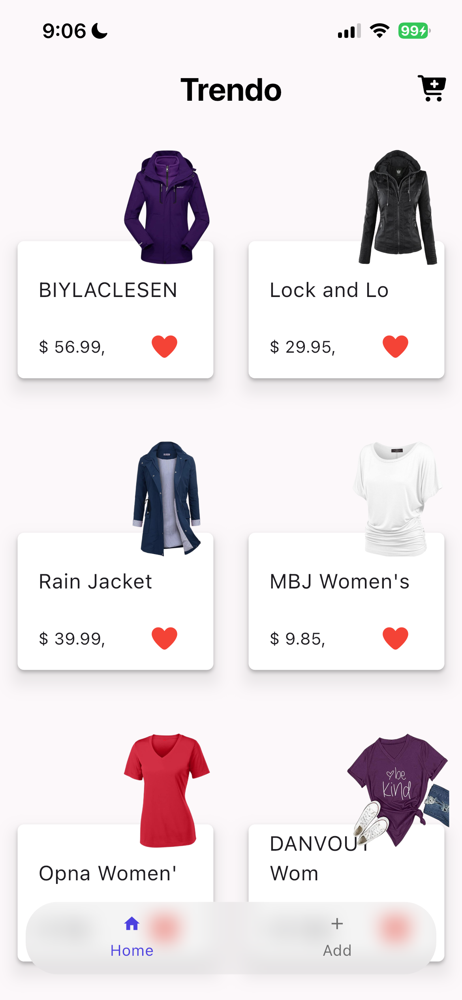
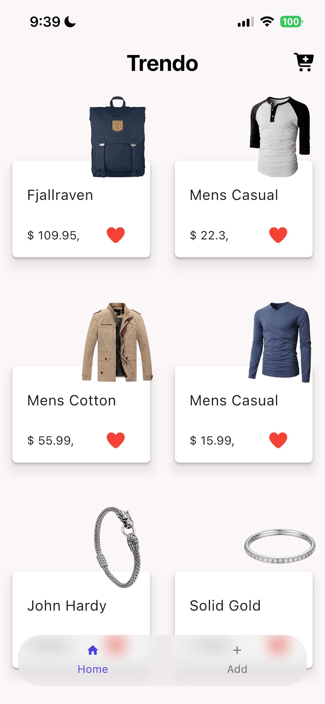
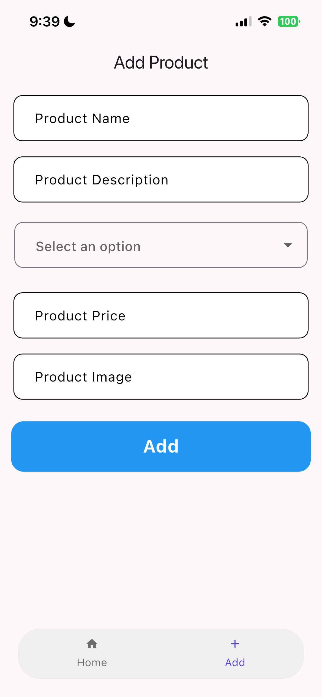
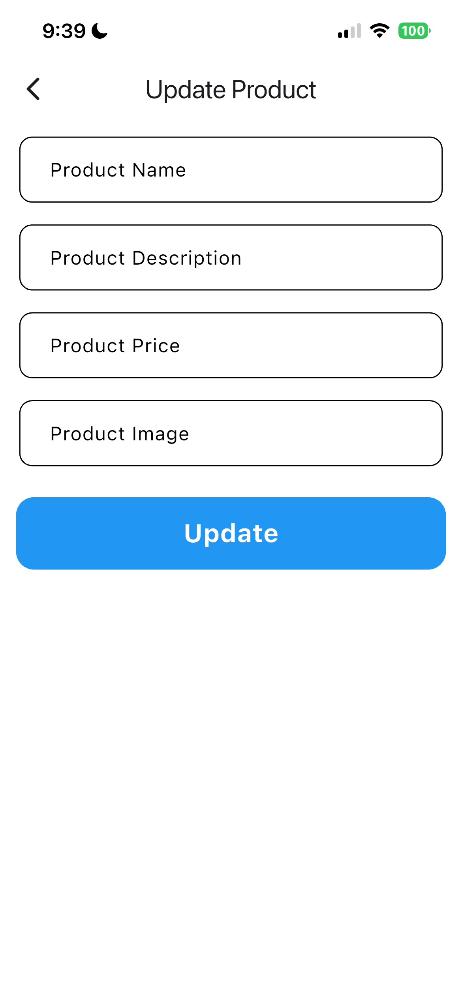

# 🛍️ Trendo

> ⚠️ **Notice: This app is still under development and not yet complete.**

---

## 📌 About the Project

**Trendo** is a mobile application built with **Flutter** that allows users to browse, add, and update products by connecting to the [Fake Store API](https://fakestoreapi.com).

---

## ✅ Features Implemented So Far

- **Browse Products** — Displays all available products on the home screen in a GridView layout.
- **Add Product** — A dedicated page to add a new product with full details (name, description, price, image, category).
- **Update Product** — Tap any product card to edit its details.
- **Bottom Navigation** — A bottom navigation bar to switch between the Home and Add Product screens.
- **Separate Service Layer** — Each operation (fetch / add / update) has its own dedicated Service class.
- **Custom Widgets** — `CustomTextField`, `CustomButton`, `CustomDropdown`, `CustomCard` for easy reuse.
- **Loading Indicator** — Uses `ModalProgressHUD` during async operations.
- **Responsive UI** — Uses `flutter_screenutil` for compatibility across different screen sizes.

---

## 📸 Screenshots

| Home Screen | Home Screen (Scrolled) |
| :---: | :---: |
|  |  |

| Add Product | Update Product |
| :---: | :---: |
|  |  |

---

## 🚧 Still In Progress

- [ ] Full product detail page
- [ ] Delete product functionality
- [ ] Shopping cart (Cart feature)
- [ ] Categories page with filtering
- [ ] Form validation on Add and Update pages
- [ ] Better error handling and user feedback
- [ ] Professional state management solution
- [ ] General UI/UX improvements

---

## 🗂️ Project Structure

```text
lib/
├── helper/
│   └── api.dart                      # HTTP layer (GET / POST / PUT)
├── models/
│   └── product_model.dart            # Product model
├── screens/
│   ├── home.dart                     # Home screen
│   ├── add_product_page.dart         # Add product screen
│   ├── update_product_page.dart      # Update product screen
│   └── select_screen_nav_bar.dart    # Main navigation shell
├── services/
│   ├── get_all_products_services.dart
│   ├── add_product_service.dart
│   ├── update_product.dart
│   ├── all_categories.dart
│   └── categories_service.dart
└── widgets/
    ├── custom_card.dart
    ├── custom_text_filed.dart
    ├── custom_dropdown.dart
    └── cutom_button.dart